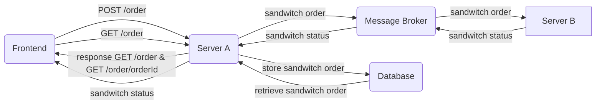

# Documentation "Order A Sandwich"-App

## Project Plan

### Group Information

**Group Member**<br>
Barbara Taskinen<br>
**Email:** barbara.taskinen@tuni.fi<br>
**Student ID:** tuni.fi:K80453<br>

**Group Name**: GroupBT<br>
**GitLab repo URL**: https://course-gitlab.tuni.fi/compcs510-spring2024/groupbt

### Working during the project

Group Member Barbara Taskinen will commit 4 - 6 hours per week to the project. As Barbara is the only group member, she will be responsible for the implementations for all the components of the application.

Initially, 23 issues were created in GitLab, based on the projected description. Likely, more issues will be added when to project progresses. Each issue was given an estimated due date for completion to ensure that the work is evenly spread out over the availiable time frame.

## Documentation of the created system

### System architecture



### Used technologies

#### "Make me a Sandwitch" Swagger API

Provided by course personnel.<br>
Provides the base for Server A.

#### Server A

The server uses the Express Node web framework and runs as an Express Web Application.<br>
<br>
Description of API endpoints:

- GET /order:
  Returns all orders<br>
- GET /order/{orderId}:
  Returns order with given `id`.
- POST /order:
  request body:

  ```
  {
    sandwichId: 8,
    status: 'ordered',
  }
  ```

  Curently, `id` property is added by addOrder function. Later, creation of id will be moved to database.<br>

  Receives REST API requests from Frontend about new orders placed and respondes to Frontend request with available sandwitch orders. Server A is connected to Frontend via WebSocket to publish updates about sandwitch status.
  When Server A receives new order from Frontend, sandwitch order is stored in database and sends message to Message Queue 1 or message broker about new order.

#### Database

MongoDB database.<br>
Stores all the order Server A has received.

#### Server B

Node.js server.<br>
Server B "makes" the sandwitch. It subscirbes to message broker Message Queue 1. Whenever it receives a new message, it will "make" the sandwitch: after a set delay, Server B will send message to message broker's Message Queue 2 that the sandwitch is ready (sandwitch order fulfilled).

#### Message Broker

RabbitMQ.<br>
Message broker with two message queues. Message Queue 1 sends information about new sandwitch orders. Message Queue 2 sends information about sandwitch order status.

#### Frontend (Client)

React Vite App written in TypeScript.<br>
Uses REST calls to place sandwitch order to Server A and to retrieve available orders from Server A. Connects to Server A through WebSocket to receive updates on sandwitch status.

### How the produced system can be tested

_Groups also must document where the components of their system are placed in the repository, and how the course personnel can deploy the group's system on their own computers when testing it._

#### Run Server A

**To run Server A as development server:<br>**

Open terminal and navigate to `server-a`.
<br><br>
Run server with commands:<br>

`npm install`
<br>
and
<br>
`npm start`

Run server in development mode on local machine with commands:<br>

`npm install`
<br>
and
<br>
`npm dev`

**Create Docker image and run Server A as Docker container:**<br>

Build the server with command, giving it the tag 'server-a':<br>

` docker build -t server-a .`

Run the container from the image in detached mode and expose port 8080:<br>

`docker run -d -p 8080:8080 server-a`

## Learning Diary

- 2024-03-23 Created issues based on [Group Project description](https://moodle.tuni.fi/pluginfile.php/4170962/mod_label/intro/Group%20project.pdf?time=1709636527702).
- 2024-03-24 Created draft of Project Documentation [Issue #22](https://course-gitlab.tuni.fi/compcs510-spring2024/groupbt/-/issues/22).
- 2024-03-29 Created Server A from Swagger API [Issue #1](https://course-gitlab.tuni.fi/compcs510-spring2024/groupbt/-/issues/1)
  - The make-me-a-sandwich Swagger API was updated to use string as id instead of iteger, because uuid library is used to create unique ids for sandwich order
  - Minimal functionality for each /order - endpoint was create where array of orders is stored as a variable.
  - Created Dockerfile to create image of Server A, chose to use image node:21, since this is the same version as installed on my machine.

## Learned issues

- 2024-03-29
  Learned how to create server stub with Swagger tools. Naively I though this would create a fairly functional server and I was surprised when nothing worked in the beginning. Yet, once I got going, I appreciated how nice base for the server was created by the Swagger tools.
  Learned to run server as a docker container. Very happy that I succeeded with this, as the whole concept of docker images and containers is difficult to grasp for me.
