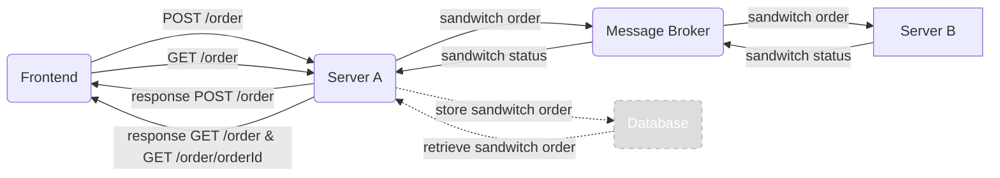
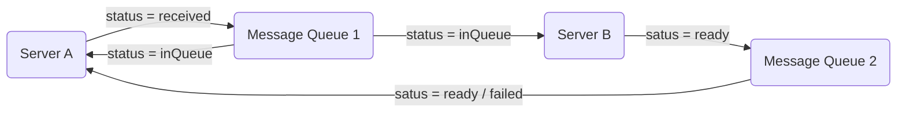

# Documentation "Order A Sandwich"-App

## Project Plan

### Group Information

**Group Member:** Barbara Taskinen<br>
**Email:** barbara.taskinen@tuni.fi<br>
**Student ID:** tuni.fi:K80453<br>

**Group Name**: GroupBT<br>
**GitLab repo URL**: https://course-gitlab.tuni.fi/compcs510-spring2024/groupbt

### Working during the project

Group Member Barbara Taskinen will commit 4 - 6 hours per week to the project. As Barbara is the only group member, she will be responsible for the implementations of all the components of the application.

Initially, 23 issues were created in GitLab, based on the projected description. Three more issues were added during the project. Each issue was given an estimated due date for completion to ensure that the work is evenly spread out over the availiable time frame. Most issues were completed within the given deadline. However, issues related to implementing a database for Server A to store the sandwich order were left undone due to time constraints.

## Documentation of the created system

### System architecture

_Broad overview of the system architecture. Detailed information about each component of the system is provided in **Used technologies**._



- Frontend sends REST requests to Server A, either placing a sandwich order with POST request to /order endpoint or fetching all the sandwich orders with GET request to endpoint /order or a specific sandwich order with GET request to endpoint /order/{orderId}.
- Server A creates id for order, stores the order in its "database" and sends message to Message Broker via Message Queue "received-orders".
- Message Broker relays message from Message Queue "received-orders" to Server B.
- Server B acknowledges the receiving of the sandwich order and "makes" the sandwich. When sandwich is done, it sends sandwich order with updated status through Message Queue 'order-fulfilled' to the Message Broker.
- Message Broker forwards Message Queue 'order-fulfilled' message about updated sandwich status to Server A.
- Server A updates status of sandwich order in "database".
- Frontend polls Server A to receive status updates of sandwich order.

### Used technologies

#### "Make me a Sandwitch" Swagger API

Provided by course personnel.<br>
Provides the base for Server A.

#### Server A

The server uses the Express Node web framework and runs as an Express Web Application.<br>
<br>
Description of API endpoints:

- GET /order:
  Returns all orders<br>
- GET /order/{orderId}:
  Returns order with given orderId `id`.
- POST /order:
  request body:

  ```
  {
    sandwichId: 1,
  }
  ```

  The property `sandwichId` represents the type of sandwich (e.i. Ham & Cheese, Tuna, Hummus...).

  Once Server A receives the sandwich order from the Frontend through the POST request to /order, calling function `addOrder` it creates an Universally Unique Identifier with the help of the `uuid` library. The created `id` is of type string. Furthermore, `addOrder` function adds status property to sandwich order object, which value is of value 'received', 'InQueue' or 'ready'. The `addOrder` function then saves the sandwich order in the "database".<br>

  Server A sends message to Message Queue "received-orders".
  Server A listens to Message Queue "order-fulfilled" to receive information about completed order.

#### Database

Database was not implemented. In Server A stores the sandwich order in an array of sandwich orders. The data is non-persistant and is lost when Server A is stopped.

Ideally, sandwich orders would have been stored in MongoDB database to allow for data persistance.

#### Server B

Node.js server.<br>
Server B is very simplistic. It simply runs a function that listens to the RabbitMQ message queue "received-orders" which handles the received sandwich orders. If a sandwitch order is received, Server B will "make" the sandwich, and after it finished "making" the sandwich (after a 10s wait), it will send message to the message queue "order-fulfilled", to inform about the fulfillment of the order.

#### Message Broker

RabbitMQ.<br>
Message broker with two message queues.<br>

- Server A send sandwich order to Message Queue 1. At this point, status of order is `received`.
- Message Queue 1 acknowledges reception of task from Server A. At this point, status of order is `inQueue`.
- Message Queue 1 sends task to Server B.
- Server B processes order. When order is ready, Server B sends message to Message Queue 2 with either status `ready` or `fail`.
- Message Queue 2 sends `ready` or `fail` message to Server A.
- Status of order is updated to either `ready` or `fail`.



For development of Message Broker, run RabbitMQ as docker container with command:<br>
`docker run -it --rm --name rabbitmq -p 5672:5672 -p 15672:15672 rabbitmq:3.13-management`

#### Frontend (Client)

React Vite App written in TypeScript.<br>
Uses REST POST requests to `http:localhost:8080/v1/order` to place sandwich order to Server A and to GET request to `http://localhost:8080/v1/order` to retrieve available orders from Server A. The app uses polling strategy to send GET requests to `http://localhost:8080/v1/order/{orderId}` every second to check order status. Once order status is 'ready', the polling stops. User can also manually request status update by clicking 'Check status'-button.

Uses React Query to make requests to Server A. React Query was choosen, since it automatically refetches data when mutations are made, making it easy to keep app data in-sync.

### How the produced system can be tested

_Groups also must document where the components of their system are placed in the repository, and how the course personnel can deploy the group's system on their own computers when testing it._

#### Run RabbitMQ Message Broker

Run RabbitMQ message broker as single docker container.

`docker run -it --rm --name rabbitmq -p 5672:5672 -p 15672:15672 rabbitmq:3.13-management`

#### Run Server A

(Important, Rabbit MQ message broker needs to run before Server A can be started)

**To run Server A as development server:<br>**

Open terminal and navigate to folder `backend/server-a`.
<br><br>
Run server with commands:<br>

`npm install`
<br>
and
<br>
`npm start`

Run server in development mode on local machine with commands:<br>

`npm install`
<br>
and
<br>
`npm dev`

**Create Docker image and run Server A as Docker container:**<br>

Build the server with command, giving it the tag 'server-a' (run command from folder `backend/server-a`):<br>

` docker build -t server-a .`

Run the container from the image in detached mode and expose port 8080:<br>

`docker run -d -p 8080:8080 server-a`

#### Run Server B

(Important, Rabbit MQ message broker needs to run before Server B can be started)

**To run Server B as development server:<br>**

Open terminal and navigate to folder `backend/server-b`.
<br><br>
Run server with commands:<br>

`npm install`
<br>
and
<br>
`npm start`

Run server in development mode on local machine with commands:<br>

`npm install`
<br>
and
<br>
`npm dev`

#### Run Frontend

**To run Frontend in development mode:<br>**

Open terminal and navigate to folder `frontend`.
<br><br>
Install dependencies:<br>

`npm install`
<br>

Start the development server:<br>

`npm run dev`
<br>

Open address `http://localhost:5173/` in browser.

**Create Docker image and run Frontend as Docker container:**<br>

Build the image with command, giving it the tag 'frontend' (run command from folder `frontend`):<br>

`docker build . -t frontend`

Run the container from the image in detached mode and expose port 5173:<br>

`docker run -d -p 5173:5173 frontend`

Open address `http://localhost:5173/` in browser to use frontend.

### Run whole application

From the root folder (groupbt), run command:

`docker compose up -d`

This will create images and run the containers for the frontend and backend.

Open address `http://localhost:5173/` in browser to use frontend.

## Learning Diary

- **2024-03-23** Created issues based on [Group Project description](https://moodle.tuni.fi/pluginfile.php/4170962/mod_label/intro/Group%20project.pdf?time=1709636527702)
- **2024-03-24** Created draft of Project Documentation [Issue #22](https://course-gitlab.tuni.fi/compcs510-spring2024/groupbt/-/issues/22).
- **2024-03-29** Created Server A from Swagger API [Issue #1](https://course-gitlab.tuni.fi/compcs510-spring2024/groupbt/-/issues/1)
  - The make-me-a-sandwich Swagger API was updated to use string as id instead of iteger, because uuid library is used to create unique ids for sandwich order
  - Minimal functionality for each /order - endpoint was create where array of orders is stored as a variable.
  - Created Dockerfile to create image of Server A, chose to use image node:21, since this is the same version as installed on my machine.
  - Learned how to create server stub with Swagger tools. Naively I though this would create a fairly functional server and I was surprised when nothing worked in the beginning. Yet, once I got going, I appreciated how nice base for the server was created by the Swagger tools.
    Learned to run server as a docker container. Very happy that I succeeded with this, as the whole concept of docker images and containers is difficult to grasp for me.
- **2024-03-30** Worked through RabbitMQ tutorials 1 - 3 [Issue #11](https://course-gitlab.tuni.fi/compcs510-spring2024/groupbt/-/issues/11)
  - tutorials gave a good idea how the message broker should look like.
  - created a sketch of how the message queues are interacting with the servers.
  - Learned basics of RabbitMQ. Seems to be straight forward. I'm hopeful that I will succeed in implementing the message broker for the project work.
- **2024-04-01**
  - Implemented Server A publishing sandwich orders to message queue A [Issue #2](https://course-gitlab.tuni.fi/compcs510-spring2024/groupbt/-/issues/2)
  - Created Server B [Issue #6](https://course-gitlab.tuni.fi/compcs510-spring2024/groupbt/-/issues/6)
  - Server B: Set up subscription of Server B to message queue A [Issue #7](https://course-gitlab.tuni.fi/compcs510-spring2024/groupbt/-/issues/7)
  - Server B: Implemented delay functionality [Issue #9](https://course-gitlab.tuni.fi/compcs510-spring2024/groupbt/-/issues/9)
  - Implemented Server B publishing to message queue B [Issue #8](https://course-gitlab.tuni.fi/compcs510-spring2024/groupbt/-/issues/8)
  - Set up basic message broker functionality, where Server A sends task to "make" sandwich to message broker, message broker relays this information to Server B, which "makes" the sandwich, once sandwich is done, message is send through message broker to Server A.
- **2024-04-06**

  - Made sure that all the settings for the producer and consumer are ok.
  - Fixed issue that order is received by Server A in wrong format.

  With the above two steps, Issues [Issue #4](https://course-gitlab.tuni.fi/compcs510-spring2024/groupbt/-/issues/4), [Issue #8](https://course-gitlab.tuni.fi/compcs510-spring2024/groupbt/-/issues/8), [Issue #10](https://course-gitlab.tuni.fi/compcs510-spring2024/groupbt/-/issues/10), [Issue #12](https://course-gitlab.tuni.fi/compcs510-spring2024/groupbt/-/issues/12) and [Issue #13](https://course-gitlab.tuni.fi/compcs510-spring2024/groupbt/-/issues/13) were closed.<br>
  The two message broker queues "received-orders" (Message Queue 1) and "order-fulfilled" (Message Queue 2) have now been implemented with basic functionality.

  - Started to create Dockerfile for Server B [Issue #25](https://course-gitlab.tuni.fi/compcs510-spring2024/groupbt/-/issues/25) and docker-compose file [Issue #23](https://course-gitlab.tuni.fi/compcs510-spring2024/groupbt/-/issues/23). However, having issues with getting `server-a` and `server-b` containers to connect to rabbitmq container `(Error: connect ECONNREFUSED 127.0.0.1:5672)`. When including the given command in `server-a` and `server-b` services, running the containers fails due to `SyntaxError: Invalid or unexpected token` in `wait-for-it.sh` script.

- **2024-04-07**

  - Worked on fixing issue with docker-compose.yml files. After giving proper permission to the `wait-for-it.sh` script and giving proper environment variables for the host, I got all the containers up and running. However, I was not able to make any request to server-a using the VS Code REST Client. The request failed with the error `socket hangup`. Will return to this issue later.

- **2024-04-07**

  - [Issue #26](https://course-gitlab.tuni.fi/compcs510-spring2024/groupbt/-/issues/26)
    Implemented updating of order status once order has been prepared and is read.<br>
    Not happy how things are flowing. Functionality is not properly linked to responses from message brocker.<br>
    Next I will work on the frontend and I hope that through this, thinks in the backend will clear themselves up. Likely what I am missing at the moment is the implementation of web sockets.

- **2024-04-20**
  - [Issue #16](https://course-gitlab.tuni.fi/compcs510-spring2024/groupbt/-/issues/16) and [Issue #15](https://course-gitlab.tuni.fi/compcs510-spring2024/groupbt/-/issues/15)<br>
    Implemented frontend UI and connected the frontend to Server A. Frontend suggessfully sends sandwich orders to ServerA and gets list of placed orders from Server A.<br>
    Learned how to use React Query.
- **2024-04-21**
  - Started working on [Issue #17](https://course-gitlab.tuni.fi/compcs510-spring2024/groupbt/-/issues/17). Refactored App component into smaller components that candle specific functionality. Started setting up the application so that the user can request an updated status of the sandwich order.
- **2024-04-22**
  - Finalized [Issue #17](https://course-gitlab.tuni.fi/compcs510-spring2024/groupbt/-/issues/17). Status of order is updated by resending request at 1s intervalls until status is 'ready'. Plan to use WebSockets for status updates was abandond due to time inexperience with WebSockets and time constrains.
  - [Issue #18](https://course-gitlab.tuni.fi/compcs510-spring2024/groupbt/-/issues/18). Created Dockerfile to build docker image and create docker container of the frontend.
- **2024-04-24**
  - Completed [Issue #23](https://course-gitlab.tuni.fi/compcs510-spring2024/groupbt/-/issues/23). Added frontend to the docker-compose.yml file. Whole application can now be run running the docker-compose.yml file.
